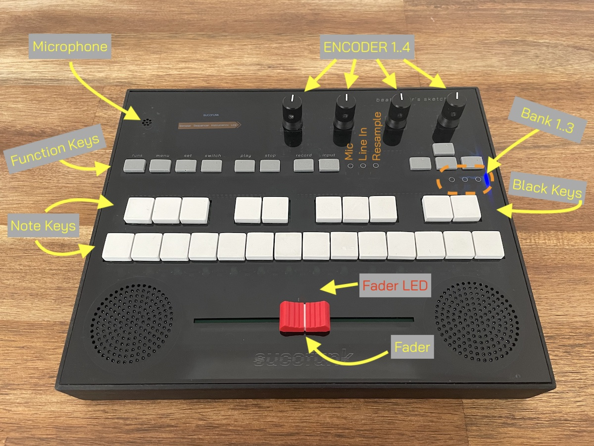
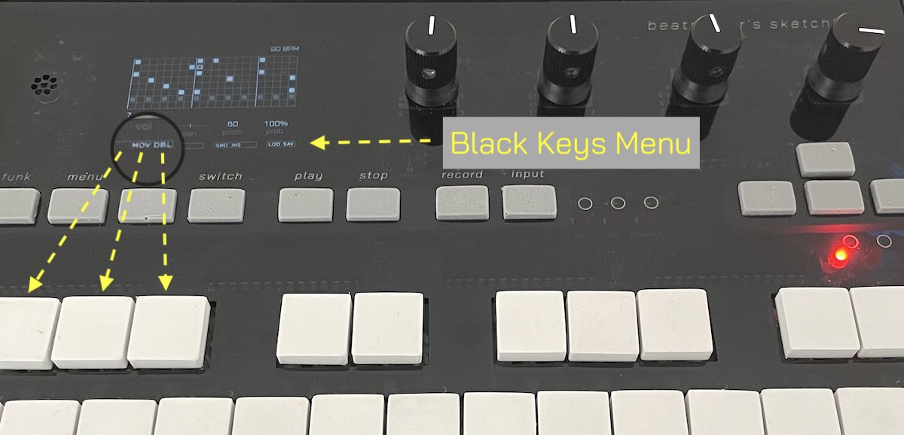

# Beatmaker's sketchbook - User manual

Beatmaker's sketchbook is developed to be as intuitive to use as possible. As you know, it is Open Source and will change and improve over time.
The learning curve is pretty flat. Just play around.

Last edit: 25.10.2022

## 1 Input controls

There are four rotary encoders with integrated push buttons.

Below the encoders is a row of 12 so called function buttons. These are:

    FUNK        The function key, to be used in combination with other keys to reveal more options
    MENU        This button will open a menu on the bottom of the screen 
    SET         This is the key to confirm or enter something
    SWITCH      Can be used to switch the white keys to act as a piano keyboard or just as buttons
                In some cases it is used to show dialogs to select something
    PLAY        You guessed it..
    STOP        I guess you guessed this one as well
    RECORD      Start and stop recording something from the selected input
    INPUT       Lets you select the input source for recording (see LEDs aside)
    CURSOR      Four cursor keys as on a normal conputer keyboard

Below this row are 24 white keys. The correspond to two octaves on a piano keyboard. In this manual they are sometimes called **Note keys**.
The black keys of a piano keyboard are not black in our case. They are white. If this manual is refering to black keys, the upper row of the white keys should be considered as black keys.

Whenever you need to enter alphanumerical characters, you use the Note Keys. The white keys correspond to letters, the black keys to numbers and special characters. It is a bit like writing with an old T9 input from a mobile phone (e.g. F -> A/B, G -> C/D and so on).

The fader on the bottom of the front panel is not a crossfader as in a DJ mixer. It is a potentiometer, used to input values. Whenever the fader is active, the red LED right above the fader is turned on.
 
 
 
## 2 Most important shortcuts
The most important key-compinations to know, as they are essential, are:

    MENU+ENCODER1   Sampler (sample)
    MENU+ENCODER2   Sequencer (sketch)
    MENU+ENCODER3   Arrange Mode (arrange) - not implemented yet
    MENU+ENCODER4   Live mode (play)

    FUNK+SET        Is the undo and sometimes delete function. Like CTRL+Z on a PC.

    MENU            Hiding the menu will cancel the current menu action
    
## 3 Starting the device
First of all, a logo is shown. In the background, the hardware will be initialized and it is checked, if a SD card is available. If there is no SD card plugged into the teensy, you cannot work with beatmaker's sketchbook. So be sure to have one attached.

Beatmaker's sketchbook is designed to work with one song at a time. When powering the device up, the **Song selector** is shown. Select a song by turning ENCODER1 or the UP/DOWN button. The hit SET or PUSH ENCODER1.

Select *create a new song* to.. you guessed it.. enter the name of the new song via the Note keys as mentioned above. It you decide not to create a new song, push FUNK+SET to cancel the operation and return to the song selector. There is no space key - just use the RIGHT key. SOng names can only have 8 characters. To enter the name, hit SET.

## 4 Switching between contexts
The main contexts *sample*, *sketch*, *arrange* and *play* are assigned to the four encoders. If you are in the main menu, just hit one of the four encoders to jump to the corresponding context. If you are in a context, use the shortcut **MENU+ENCODER 1/2/3/4** to change the context.

Holding the FUNK key for more than five seconds (and do not to release the key), will bring you to the settings menu.

Holding the MENU key for more than five Seconds, will bring you back to the main screen.

## 5 The menu

There are two different kind of menus. When hitting the MENU key they both open at the bottom of the screen.

### Cursor menu
The most simple menu opens up to three menu points. Swith between them with the LEFT and RIGHT keys. Use SET to select the highlighted menu item.

### Black keys menu
The black keys menu shows up to ten tree-letter abbreviations. They are clustered in four bundles with three or two abbreviations. As the name says, these abbreviations correspond to the black keys of the piano keyboard.
Whenever the black key menu is open, the white keys do not act as sample- or note selector. Hit MENU again to hide the menu and the Note keys can be used as expected.
Some operations lock the menu, until the operation is finished - e.g. deleting a sample; you need to hit the delete option again to confirm the delete process.

## 6 Recording
To record from the internal microphone, the Line IN or to resample something, hit the RECORD button. To record something, you need to select the input. Use the INPUT key to switch between the inputs. The three LEDs beside the INPUT button correspond to: MIC, LINE IN and RESAMPLE. When two LEDs are shining at the same time, it is a combination of RESAMPLING and MIC or LINE IN.

There is a peak meter shown on the display to show the input level. When recording from the microphone, use ENCODER1 to adjust the gain. Pay attention, when the volume of the speakers is too high and the gain, too, there might appear a feedback noise. Best results will appear while recording with a headphone, as the speakers are switched off, when the headphone is plugged in.

To start the recording, hit RECORD again. To stop the recording, hit RECORD once again.
If you hit RECORD by accident, hit FUNK+RECORD to cancel recording. This does not work while recording.

After recording, the record will be shown in the sampler. If you do not delete the *latest recording*, it will always show up, when entering the sampler context. If you record something else, the latest recording will be overwritten. Hiding the menu will cancel the operation.

## 7 Sampler

In general, we have three sample banks which are selectable via the LEFT and RIGHT keys. The LEDs will indicate which Bank is active. 
Each sample bank can hold 24 samples. One sample corresponds to one white key. In total there are 72 samples per song.

Within the sampler, all samples are played directly from the SD card. Playing multiple samples at a time is not possible in this place.

The latest recording is never assigned to a sample unless you save it to one.

In general, just follow the instructions on the screen.

The Options in the Black keys menu are:

    SAV   Save the current sample
    SAS   Save the current sample/selection to another sample slot
    DEL   Delete the current sample

    CUT   Cut the current sample

The **Sample library** (SWITCH at an empty sample slot) displays all samples on the SD card in the folder /SAMPLES.
PLAY to pre-listen the library sample. Use SET to select the selected sample, cancel by hitting SWITCH again. 

### Cutting a sample
When cutting a sample (Menu -> CUT), ENCODER1 moves the start pointer, ENCODER2 moves the end pointer. Encoder 3 adjusts the volume.
Playing the selected part is always possible by hitting PLAY.

To fine-adjust the start- and end-point, use FUNK+ENCODER1/2. The amount of 16 Bits (one amplitude change) will be shown on top. Pay attention that it resets to zero, if you change it again without holding FUNK.

You can push ENCODER1 and ENCODER2 to give control over the marker to the fader. Push the Encoder again to set the position from the fader and fine-adjust it.

When the right part is selected, you can SAV it and overwrite the current sample with the selected part.
With SAS (save as) the selection can be saved to a free sample slot. Free sample slots light up green.

## 8 Sequencer (sketch)

The sequencer is just a matrix with 8 lines (channels) and almost endless columns. It is called a sketch. Sketches can be divided into sheets (on other devices it would be called pattern). One channel is not bound to anything. You can place different samples right after each other. If one sample is still playing, the next one will stop it and play itself. While a sample is playing, **Parameter changes** can adjust the volume and panning of a sample.
Each Sample can be adjusted by volume, panning, (chromatic) pitch with a midi basenote of 60 (C4) and a probability to be played.
Swing can be added to a single sample or swing groups. Swing can only be used to delay the playback of a sample. To play a sample before the timing, you need to trigger it one step earlier and delay it with swing. Samples can be assigned to swing groups. When the swing value of one sample in the group is changed, all samples in the group will inherit the same value. Swing groups are displayed in different colors. Samples with swing are marked with a small vertical line on the grid. The value of swing is displayed below the grid on the right side (above probability) on a 11 raster bar.
Use ENCODER1 for volume, ENCODER2 for panning, ENCODER 3 for pitch and ENCODER 4 for probability. If you do not want to turn the encoders, you can always push the encoder and the current value of the fader will be taken instead.

Black key Menu Options

    SEL
    To start a selection. Move the cursor and a selection will span. PLAY will play just the selection. Use SNI to save the selection as a snippet.

    MOV     
    Move a grid cell to another position. Go to the source cell, hit MOV, go to the destination and hit MOV again.
    
    DBL     
    Double an cell. This makes a copy of the cell you hit DBL on. Move the cursor to the copy detination and hit DBL again.    
    If you hit DBL twice, a copy of the current active cell will be added to the cell right beside it - if it is empty.

    SNI
    Snippets. Can be saved to one of the 14 white keys of the keyboard from a selection. Free slots will light up on the keyboard.
    When entering the SNI mode while the cursor is within a snippet, you can use PLAY to listen only to the snippet or delete it by deselecting the lighting white key again.

    SND     
    Sound has two Options. It can be used as a Parameter change for playing samples (Volume, Panning and fine grained Pitch) and as a Note off to stop the currently playing sample.
    Hit it once, it's a parameter change, hit it again, it becomes a Note Off (Sample only, not a Midi Note off).

    INS
    Adds a MIDI Out message. You can adjust the MIDI parameters Velocity, Channel and Note with ENCODERS1..3.
    To send a corresponding Note Off, you need to send the exact same Note/Channel combination with a Velocity of zero. If the velocity is zero, it will be marked with a red X on the grid.

    REV
    Reverse changes the playback direction of a sample. Can be used with parameter changes to change the playback direction while playing a sample.

    CLS
    Clear Selection -> when used on a selection
    Clear Song -> removes everything from the current sketch. Affects, when no selection is active. You need to confirm that operation with a second hit on CLS.

Playback behavior

    PLAY    Play song
    PLAY    Stop playback (when playing) and start next playback at the beginning of the sheet the cursor is located on
    STOP    Stop playback and start next playback from the beginning

Auto Save behavior

    A song will be automatically saved, but not at every interaction, as saving takes a few milliseconds. Saving will happen when you pause or stop a playback. To force autosaving, just hit STOP.

Shortcuts

    FUNK+ENCODER1   move cursor (fast) vertically
    FUNK+ENCODER2   move cursor (fast) horizontally
    FUNK+ENCODER3   scoll over grid horizontally
    FUNK+ENCODER4   change song/grid length

    FUNK+UP         Zoom in
    FUNK+DOWN       Zoom out
    FUNK+LEFT       Sample Bank down
    FUNK+RIGHT      Sample Bank up

    FUNK+NOTE       Pre-listen Sample
    FUNK+PLAY       Pre-listen to sample at cursor position

    MENU+UP         Create a sheet divider before the current cursor position.
    MENU+DOWN       Removes a sheet divider at the current cursor position.
    MENU+RIGHT      Jumps to the next sheet.
    MENU+LEFT       Jumps to the previous sheet.
    
    SET+LEFT/RIGHT  Changes the swing value of a single sample or the value of a complete swing group, if a group is selected (different colors).
    SET+UP/DOWN     Changes the swing group the sample is assigned to.

    ENCODER1        On an empty grid cell, it will change the playback speed BPM

While playing

    FUNK+ENCODER1   Change playback BPM

    A lot of functions are working even while playing, but they might impact the playback speed, as refreshing the display takes some time (needs to be fixed).

## 9 Play mode

Play mode is for live performances and playing around with samples and snippets. Each key on the keyboard can be assigned to a sample or a snippet. All three banks can be used - 72 slots in total can be assignet. Each note on the keyboard can be triggered from external MIDI gear on MIDI channel 1 (the channel will be configurable in future versions). Each slot is by default assigned to the corresponding standard MIDI note of the position (e.g. the first C on the second bank is note 60). The midi note for each slot can be changed by a) selecting a note or b) learning from an incoming MIDI signal.

To assign a snippet or sample to a slot, hit an not assigned key (displayed as black slot on the keyboard on the display). You will be prompted to use it as a snippet or sample slot. Use LEFT/RIGHT to change the value, hit SET to enter. Then select a sample or snippet from the keyboard. SET will assign the played snippet/sample. In the third step, different parameters can be set. 

For *samples* these are: Velocity (will be overwritten when triggered from an external MIDI device with velocity value), panning and pitch. *Play complete* (ENCODER1) will play the whole sample, wehen triggered, *while hold* will stop playing the sample, ehen the key is released. FORWARD and REVERSE (ENCODER 2) will change the playback direction. ENCODER 4 changes the assigned MIDI note (will not affect the slot position on the internal keyboard). Pushing ENCODER4 will set the device into the learning mode and wait for an incoming MIDI note on channel 1. Pushing ENCODER4 again will assign the MIDI note. If the note is displayed in red, the MIDI note is already assigned to another slot. If you save (SET) with an already assigned MIDI note, it cannot be triggered from external gear.
Push SET to save the sample configuration.

For snippets these are: *play complete* / *instant stop* (ENCODER1) will play the complete snippet or stop the snippet when the snippet is triggered again. *LOOP*/*ONCE* (ENCODER2) will play the snippet only once or loop it until it is triggered again. The MIDI note functionality (ENCODER4) is identical to the one of the samples.

When there are samples and/or snippets assigned to slots, the slots will be displayed in different colors. Pushing a SLOT key will play the saved configuration.
For editing a slot again, hit FUNK+SLOT KEY to enter the edit mode again. Use SET to save the configuration and return to the overview or hit FUNK+SET to remove the sample/snippet from the slot.

ENCODER1 in the overview will change the playback speed of the snippets. The initial value is taken from the sequencer and can be overwritten. Changing the speed in play mode will not affect the BPM set in the sequencer.

SWITCH will ask you to select a sample. When a sample is selected, it can be played chromatically via the keyboard. This mode is called PIANO mode. Only one Sample can be assigned to PIANO mode and it is displayed in red on the overview. Whenever you hit switch on a live performance, the PIANO mode will start with the selected sample. The PIANO sample can be played via an external MIDI keyboard on MIDI channel 2 - with up to 8 notes (polyphony) at a time. FUNK+SET in piano mode will clear the sample from piano mode. 

In total, 24 channels are available for live mode. 16 channels for snippets and 8 for samples/piano. If all channels are in use, triggering another sample/snippet will be ignored.
The 8 channels for samples can be triggered with polyphonic aftertouch from external midi gear.

To record a live performance, hit RECORD, select *resample* via the input selector, start recording and switch back (MENU+ENCODER4) to play mode. Hit RECORD again to stop recording your session. The recorded session is saved to the internal SD card and will immediately be displayed in the SAMPLE mode.

## 10 Technical stuff

## 10.1 SD-card

Everything is stored on the SD card on the teensy 4.1 microcontroller.
There are two directories on the root folder of the SD-Card.

    /SAMPLES    
    This is the directory where the sample library is stored. Currently samples may only be saved as 44khz mono .raw files. Subdirectories will be ignored.
    
    /SONGS      
    The  subdirectories below this folder contain one song, each. If you want to delete a song, just delete the corresponding directory. 

## 10.2 Updating the firmware

To update the firmware of your Beatmaker's sketchbook, just compile the sources of this project or get a pre-compiled version.
The latest pre-built version as .hex file is stored [here](/built/).

To install it, you need the [Teensy Loader application](https://www.pjrc.com/teensy/loader.html) installed on your PC or Mac. Make sure to read the very short manual and upload the .hex file to the  teensy inside Beatmaker's sketchbook. If you need to hit the program button, open the device and push the program button. It is located as an extra button on the bottom side of the printed circuit board.