# Beatmaker's Sketchbook — User Manual

Firmware version: 0.9.9  
Last updated: May 2026

---

## Table of Contents

1. [Introduction](#1-introduction)
2. [Hardware Reference](#2-hardware-reference)
3. [First Steps](#3-first-steps)
4. [Recording](#4-recording)
5. [Sampler](#5-sampler)
6. [Sequencer (Sketch)](#6-sequencer-sketch)
7. [Arrange Mode](#7-arrange-mode)
8. [Live / Play Mode](#8-live--play-mode)
9. [SynthCopy](#9-synthcopy)
10. [Settings](#10-settings)
11. [Technical Reference](#11-technical-reference)
- [Appendix A — Quick Reference Card](#appendix-a--quick-reference-card)

---

## 1. Introduction

Beatmaker's Sketchbook is a standalone hardware sampler and step sequencer. You record or load audio samples, arrange them in a grid-based sequencer, chain patterns into a full song, and perform live — all without a computer.

**Typical workflow:**

1. **Record** samples from the internal microphone or line-in — or import files from the SD card.
2. **Edit** them in the Sampler (trim, rename, set pitch).
3. **Compose** in the Sequencer: place samples on a grid across 8 channels.
4. **Arrange** sketches into a full song.
5. **Perform** live with the Play mode: trigger samples, snippets, and scratch effects.

Everything is stored on an SD card. The device works with one song at a time.

---

## 2. Hardware Reference

### 2.1 Controls Overview

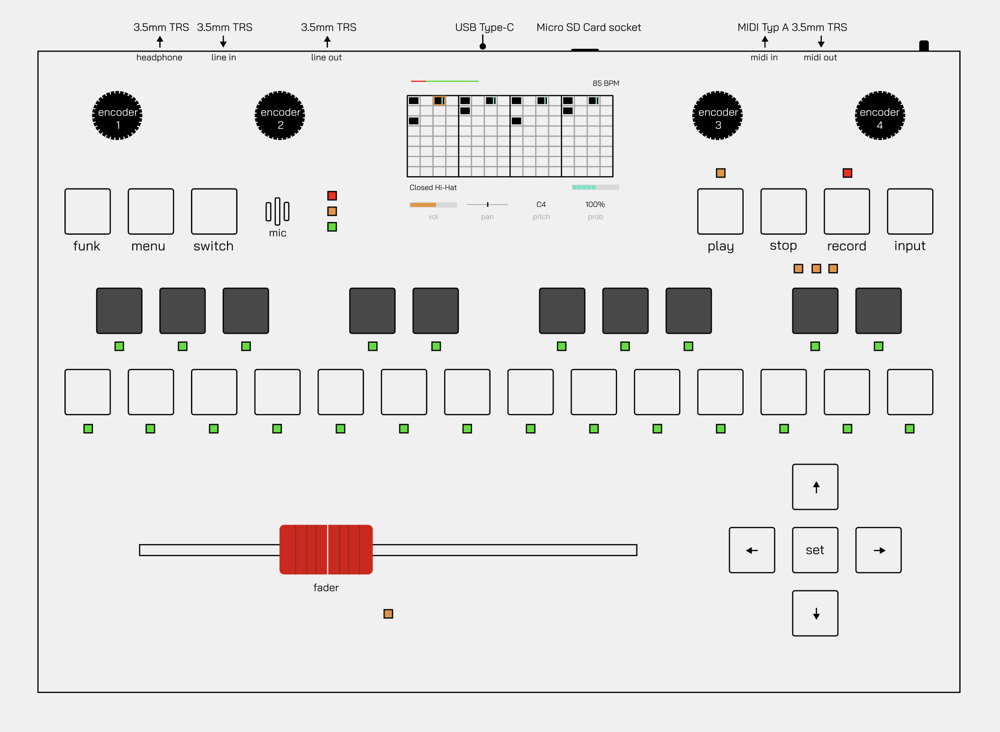

#### Function Buttons (row below the encoders)

| Button | Base action | FUNK + button | MENU + button |
|---|---|---|---|
| **FUNK** | Hold to activate the FUNK modifier | — | — |
| **MENU** | Open / close the black-key menu | — | Hold 5 s → return to Home |
| **SWITCH** | Context-specific action (zoom, display toggle, or browser) | — | — |
| **PLAY** | Start playback | Preview sample at cursor | — |
| **STOP / PAUSE** | Stop playback | — | — |
| **RECORD** | Start / stop recording | Cancel recording (before it starts) | — |
| **INPUT** | Cycle input source (MIC / LINE / RESAMPLE) | — | — |

#### Navigation

| Control | Action |
|---|---|
| **Cursor LEFT / RIGHT** | Move horizontally; change bank |
| **Cursor UP / DOWN** | Move vertically; change value |
| **SET** (centre of cursor pad) | Confirm / enter |
| **FUNK + SET** | Undo / delete |

#### Encoders

There are four rotary encoders, each of which can also be pushed like a button.

| Encoder | Typical role | MENU + push |
|---|---|---|
| **ENCODER 1** | Volume / Gain / BPM | Switch to Sampler |
| **ENCODER 2** | Panning | Switch to Sequencer |
| **ENCODER 3** | Pitch | Switch to Arrange |
| **ENCODER 4** | Probability | Switch to Live / Play |

> **Switching modes:** While in any main mode, hold **MENU** and push an encoder to jump to a different mode.

#### Fader

The fader at the bottom of the front panel is a **value input**, not a crossfader. When the fader is active, the small **fader LED** below it lights up. Depending on the context it controls volume, trim points, velocity, pitch, panning, or scratch speed.

#### The 24-Key Keyboard (Note Keys)

The keyboard spans two octaves and is organised into **3 banks**. The bank indicator LEDs on the top right of the keyboard, below the STOP and RECORD buttons, show the active bank. Each bank holds 24 sample slots, giving **72 slots per song** in total.

The keyboard also doubles as a **text entry pad** whenever a name has to be entered: white keys = letters, black keys = numbers and special characters.

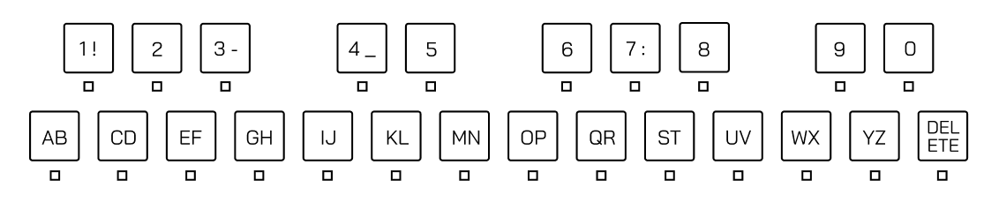

#### LED Indicators

| LED(s) | Meaning |
|---|---|
| Bank 1 / 2 / 3 LEDs | Active sample bank |
| Input LEDs (×3) | Active recording input — green = MIC, orange = LINE, red = RESAMPLE |
| Fader LED | Fader is active |
| Key LEDs | Vary by mode — lit = assigned; blinking = queued or playing |

---

### 2.2 The Black-Key Menu

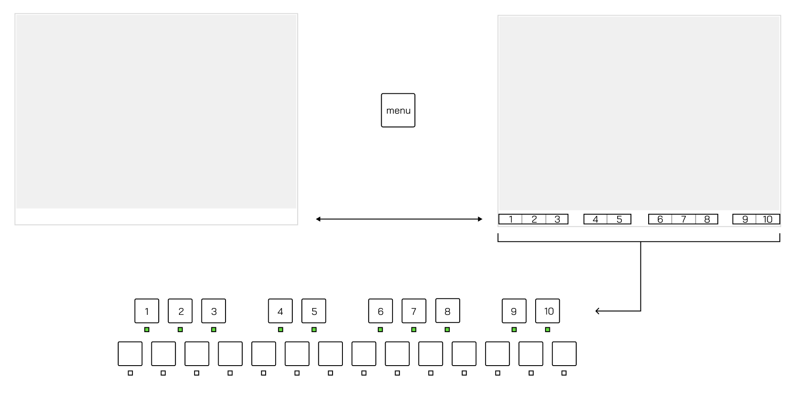

Pressing **MENU** in most modes opens an overlay at the bottom of the screen. Up to ten three-letter options appear, each mapped to one of the black keys on the keyboard. The options available change depending on the current mode.

- Press **MENU** again to close the menu without selecting anything.
- Some operations **lock** the menu open until they are confirmed (for example, deleting a sample requires pressing the delete option a second time).

---

## 3. First Steps

### 3.1 Starting the Device

On power-up a logo is shown while the hardware initialises. The device checks for an SD card — **an SD card must be inserted at all times**. Without one, the device cannot proceed.

After initialisation the **Song Selector** is shown.

### 3.2 The Song Selector

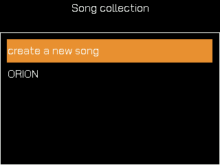

- Rotate **ENCODER 1** or press **UP / DOWN** to scroll through existing songs.
- Press **SET** or push **ENCODER 1** to load the highlighted song.
- To create a new song, select **"Create a new song"** at the bottom of the list, type the name (max 8 characters) using the Note Keys, and confirm with **SET**.
  - There is no space character — press **RIGHT** to insert a space.
  - Song names are limited to 8 characters.
- To cancel creating a new song press **FUNK + SET**.

### 3.3 Switching Between Modes

The four main modes are always one shortcut away:

| Shortcut | Mode |
|---|---|
| MENU + ENCODER 1 | Sampler |
| MENU + ENCODER 2 | Sequencer (Sketch) |
| MENU + ENCODER 3 | Arrange |
| MENU + ENCODER 4 | Live / Play |

Holding **MENU for 5 seconds** always returns to the Home screen from any mode.

### 3.4 The Home Screen

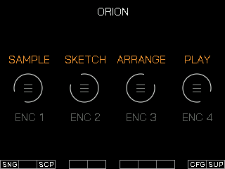

From the Home screen, the black-key menu provides access to additional areas:

| Black key | Label | Destination |
|---|---|---|
| 1st | SNG | Song Selector |
| 3rd | SCP | SynthCopy |
| 9th | CFG | Settings |
| 10th | SUP | Supporter screen |

---

## 4. Recording

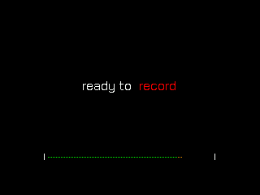

The Recorder captures audio from three possible sources and saves it as a sample.

### 4.1 Selecting the Input

Press **INPUT** to cycle through the input sources. The three LEDs next to the INPUT button show the active source:

| LED | Input |
|---|---|
| Green | Internal microphone |
| Orange | Line-in |
| Red | Resample (records the device's own audio output) |

Two LEDs lit at the same time indicates a combined source (e.g. MIC + RESAMPLE).

### 4.2 Adjusting Levels

| Control | Effect |
|---|---|
| ENCODER 1 | Microphone gain |
| ENCODER 2 | Line-in sensitivity |

A **peak meter** on the display shows the incoming level. When using the microphone, keep the speaker volume low to avoid feedback. Plugging in a headphone mutes the speakers automatically.

Press **SWITCH** to toggle the peak meter between the screen display and the input-selector LEDs.

### 4.3 Recording a Sample

1. Select the input source with **INPUT**.
2. Press **RECORD** to start — the peak meter stays visible.
3. Press **RECORD** again to stop.
4. If you started by accident, press **FUNK + RECORD** to cancel *(only works before recording has actually started)*.

After stopping, the recording is immediately shown in the Sampler as the *latest recording*. It stays there until you save it to a slot or record something new (which overwrites it). Closing the menu without saving discards the recording.

### 4.4 Multi-Sample Recording (Auto-Slice)

Multi-sample recording automatically splits a long take into individual samples at silence gaps. This is useful for capturing multiple sounds in one pass — for example, a set of drum hits recorded one after another.

Configure the silence threshold and the minimum silence duration, then record normally. The device detects each gap, slices the recording, and saves consecutive samples to free slots.

---

## 5. Sampler

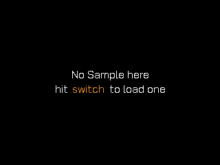
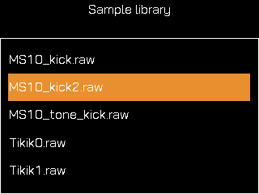
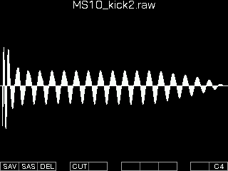

The Sampler is where you view, trim, rename, and manage your samples.

### 5.1 Banks and Slots

There are **3 banks × 24 slots = 72 sample slots** per song. Press **LEFT / RIGHT** to change the active bank. The bank LEDs on the keyboard reflect the current bank.

Each of the 24 piano keys corresponds to one slot in the current bank. Press a key to select and preview that slot. Its waveform is shown on the display.

### 5.2 Loading Samples from the Library

The **library** shows all `.raw` files in the `/SAMPLES/` folder on the SD card.

1. Press **SWITCH** on an empty slot to open the library browser.
2. Navigate with **UP / DOWN** (files within a folder) and **LEFT / RIGHT** (enter / leave folders).
3. Samples play automatically as you scroll for pre-listening — press **PLAY** to hear the current file again.
4. Press **SET** to assign the selected file to the slot.
5. Press **SWITCH** again to cancel.

### 5.3 The Sampler Menu

Press **MENU** to open the black-key menu:

| Option | Action |
|---|---|
| **SAV** | Save / overwrite the current sample |
| **SAS** | Save a selection to a different (free) slot |
| **DEL** | Delete the sample — press again to confirm |
| **CUT** | Enter trim / cut mode |
| **C4** | Set the base MIDI note (label updates to the current note) |

### 5.4 Cutting a Sample

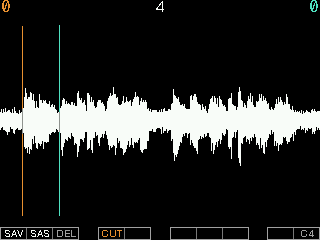

Open **MENU → CUT** to enter trim mode.

| Control | Effect |
|---|---|
| ENCODER 1 | Move the **start** marker |
| ENCODER 2 | Move the **end** marker |
| ENCODER 3 | Adjust playback volume |
| FUNK + ENCODER 1 | Fine-adjust the start marker (one amplitude step at a time) |
| FUNK + ENCODER 2 | Fine-adjust the end marker |
| Push ENCODER 1 | Hand the start marker to the fader; push again to set |
| Push ENCODER 2 | Hand the end marker to the fader; push again to set |
| LEFT / RIGHT | Shift the entire selected region (useful for equal-size loop slices) |
| PLAY | Preview the selected region |

> Fine-adjust resets to zero each time you switch to it without holding FUNK.

Once the selection is right:

- **MENU → SAV** — overwrites the original sample with the trimmed region.
- **MENU → SAS** — saves the trimmed region to a free slot (free slots light up green).

### 5.5 Setting the Base Note

The base note tells the device which musical pitch this sample represents. It defaults to **C4**. Setting it correctly ensures chromatic pitch-shifting works accurately.

Open **MENU → C4** (the label shows the current note), then press the piano key that matches the sample's root pitch. Use **LEFT / RIGHT** to change octaves. Press **SET** to confirm.

---

## 6. Sequencer (Sketch)

The Sequencer is the main composition tool. It is a grid of **8 channels** (rows) × an almost unlimited number of **steps** (columns). The grid can be divided into **sheets** — equivalent to patterns on other devices.

### 6.1 Basic Concepts

- **Channels:** 8 horizontal lanes. Each lane can hold any combination of samples — channels are not bound to a fixed instrument.
- **Steps:** Each column is one beat subdivision. Grid resolution is adjustable with Zoom.
- **Sheets:** Vertical dividers split the grid into named sections that feed into the Arrange mode.
- **Snippets:** Named sub-selections that can be triggered independently in the Live / Play mode.

### 6.2 Navigating the Grid

| Control | Action |
|---|---|
| Cursor LEFT / RIGHT | Move the step cursor |
| Cursor UP / DOWN | Move the channel cursor |
| MENU + RIGHT | Jump to the next sheet |
| MENU + LEFT | Jump to the previous sheet |
| MENU + UP | Create a sheet divider at the cursor position |
| MENU + DOWN | Remove the sheet divider at the cursor position |
| FUNK + ENCODER 3 | Move cursor horizontally (fast) |

### 6.3 Placing and Removing Samples

- Press a **Note Key** to place the sample assigned to that key (in the current bank) at the cursor position.
- Press **FUNK + Note Key** to preview a sample without placing it.
- Press **FUNK + PLAY** to preview the sample already at the cursor position.
- Press **FUNK + SET** to delete the entry at the cursor.

### 6.4 Per-Sample Parameters

Each placed sample has four adjustable parameters. Turn the corresponding encoder to change the value, or **push the encoder** to take the current fader value instead.

| Encoder | Parameter | Notes |
|---|---|---|
| ENCODER 1 | **Velocity** (volume) | 0–127 |
| ENCODER 2 | **Panning** | Left – Centre – Right |
| ENCODER 3 | **Pitch** | Chromatic, relative to the sample's base note |
| ENCODER 4 | **Probability** | 0–100 % — chance the sample plays on each pass |

Rotating ENCODER 1 on an **empty** grid cell changes the global **BPM** for the sketch.

### 6.5 Swing

Swing delays the playback of individual samples to add groove. Swing can only *delay* a sample — to play a sample slightly early, place it one step earlier and delay it with swing.

| Control | Action |
|---|---|
| SET + LEFT / RIGHT | Adjust the swing value for the sample at the cursor |
| SET + UP / DOWN | Assign the sample to a swing group |

Samples in the same **swing group** share a value — changing one member updates all others. Groups are colour-coded on the grid. A small vertical tick on a cell indicates swing is applied. The current swing value is shown below the grid.

### 6.6 Zoom

| Shortcut | Action |
|---|---|
| FUNK + UP | Zoom in (finer grid resolution) |
| FUNK + DOWN | Zoom out (coarser resolution) |
| FUNK + ENCODER 4 | Change the total song / grid length |

### 6.7 Sample Banks in the Sequencer

| Shortcut | Action |
|---|---|
| FUNK + LEFT | Previous sample bank |
| FUNK + RIGHT | Next sample bank |

### 6.8 The Sequencer Menu

Press **MENU** to open the black-key menu:

| Option | Action |
|---|---|
| **SEL** | Start a selection. Move the cursor to expand it. PLAY plays only the selection. Use SNI to save the selection as a snippet. |
| **MOV** | Move: press MOV at the source cell, navigate to the destination, press MOV again. |
| **DBL** | Duplicate: press DBL at the source, navigate to the destination, press DBL again. Pressing DBL twice in the same place copies the cell immediately to the right (if empty). Works on selections too. |
| **SNI** | Save the current selection as a snippet — assign it to one of the white keys (free slots light up). Entering SNI mode while inside an existing snippet lets you preview or delete it. |
| **SND** | Insert a Parameter Change cell (adjusts volume, panning, or pitch of a sample that is already playing). Press once = parameter change; press again = Note Off (stops the playing sample). |
| **INS** | Insert a MIDI Out event. Set velocity with ENCODER 1, channel with ENCODER 2, note with ENCODER 3. Velocity = 0 sends a Note Off and is shown as a red X. |
| **REV** | Reverse the playback direction of the sample at the cursor. |
| **MUT** | Mute / unmute the current channel. Muted channels show a red indicator on the right side of the screen. |
| **CLS** | Clear the selection (if active), or clear the entire sketch (requires a second press to confirm). |

### 6.9 Playback

| Control | Action |
|---|---|
| PLAY | Start playback from the beginning of the sheet the cursor is in |
| PLAY (while playing) | Stop and cue back to the beginning of the current sheet |
| STOP / PAUSE | Stop and cue to the very beginning of the sketch |
| FUNK + ENCODER 1 (while playing) | Adjust BPM live |

### 6.10 Shortcuts Summary

| Shortcut | Action |
|---|---|
| Note Key | Place sample at cursor |
| FUNK + Note Key | Preview sample |
| FUNK + PLAY | Preview sample at cursor |
| FUNK + SET | Delete entry at cursor |
| ENCODER 1 / 2 / 3 / 4 | Velocity / Pan / Pitch / Probability |
| Push encoder | Take value from fader |
| SET + LEFT / RIGHT | Adjust swing value |
| SET + UP / DOWN | Change swing group |
| FUNK + UP / DOWN | Zoom in / out |
| FUNK + LEFT / RIGHT | Change sample bank |
| FUNK + ENCODER 3 | Move cursor fast |
| FUNK + ENCODER 4 | Change song / grid length |
| MENU + LEFT / RIGHT | Previous / next sheet |
| MENU + UP / DOWN | Add / remove sheet divider |
| ENCODER 1 (empty cell) | Set BPM |
| FUNK + ENCODER 1 (playing) | Adjust BPM |

---

## 7. Arrange Mode

The Arrange mode chains sheets from the Sequencer into a complete song. The grid plays **left to right, top to bottom**. Playback stops at the first empty cell, so multiple independent arrangements can coexist.

### 7.1 Building an Arrangement

- Navigate with the **Cursor keys**.
- Press a **white piano key** to insert the corresponding sheet number at the cursor position.
- Press **FUNK + SET** to remove the sheet from the current cell.
- Press **FUNK + UP** to add one repetition to a cell (the cell plays that many additional times). The display shows +1, +2, … for each press.
- Press **FUNK + DOWN** to remove a repetition.

### 7.2 Playback

| Control | Action |
|---|---|
| PLAY | Start from the cursor position |
| PLAY (while playing) | Pause; pressing PLAY again resumes from the paused position |
| FUNK + PLAY | Start from the very beginning of the arrangement |
| STOP / PAUSE | Stop; cursor resets to position 0 |

### 7.3 Channel Solo (for DAW recording)

When recording individual channels into a DAW via USB audio, you can isolate one channel at a time:

- Press **black keys 1–8** to solo the corresponding channel.
- Press the same key again to un-solo.

### 7.4 Shortcuts Summary

| Shortcut | Action |
|---|---|
| White keys | Insert sheet at cursor |
| FUNK + SET | Remove sheet from cursor |
| FUNK + UP | Add one repetition |
| FUNK + DOWN | Remove one repetition |
| PLAY | Start from cursor |
| FUNK + PLAY | Start from beginning |
| STOP / PAUSE | Stop; reset to position 0 |
| Black keys 1–8 | Solo channel 1–8 |

---

## 8. Live / Play Mode

Live mode provides **72 pads** (3 banks × 24 keys) to trigger samples, snippets, and scratch effects during a performance.

### 8.1 Slot Types

Each key can be assigned one of four slot types:

| Type | What it does |
|---|---|
| **Sample** | Plays a single sample with configurable velocity, panning, pitch, and playback behaviour |
| **Snippet** | Triggers a sequencer snippet (loop or one-shot) |
| **Scratch / Unmute** | Unmutes a channel and controls playback speed with the fader |
| **Fader Adjust** | Repositions the fader without changing any parameter — used in Vinyl Scratch mode to reset the fader to a new position |

### 8.2 Slot Color Coding

Each key is filled with a color and a small icon that shows the slot type and configuration at a glance:

| Slot | Description |
|------|-------------|
|  | **Empty** — not assigned |
|  | **Snippet** — triggers a sequencer snippet |
|  | **Sample** — plays a sample with velocity, panning, and pitch |
|  | **Sample – Tape Scratch** — fader controls playback speed directly |
|  | **Sample – Vinyl Scratch** — fader controls acceleration like a vinyl record. When the fader reaches an edge, press an assigned **Fader Adjust** key to reposition it without affecting playback |
|  | **Sample – DVS Scratch** — timecode signal from line-in controls playback |
|  | **Piano** — sample plays chromatically across the keyboard (up to 8 voices) |
|  | **Mute / Scratch** — mutes a channel; fader scratches it |
|  | **Unmute / Scratch** — unmutes a channel; fader scratches it |
|  | **Fader Adjust** — press to move the fader to a new position without affecting any parameter; used to reset the fader in Vinyl Scratch mode |

### 8.3 Assigning a Slot

1. Press **FUNK + Note Key** to enter edit mode for that slot.
2. If the slot is empty, use **UP / DOWN** to choose the slot type and press **SET**.
3. For **Sample** and **Snippet** slot types, use the note keys to select the sample or snippet to assign, then press **SET**. Use **LEFT / RIGHT** to switch the sample bank when selecting a sample. (This step is skipped for Mute / Unmute / Fader Adjust slot types.)
4. Configure parameters with the encoders (see below), then press **SET** to save.
5. Press **FUNK + SET** to remove the assignment from a slot.

### 8.4 Sample Parameters

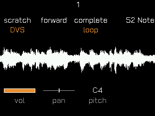

| Control | Parameter |
|---|---|
| ENCODER 1 (rotate) | Velocity |
| ENCODER 2 (rotate) | Panning |
| ENCODER 3 (rotate) | Pitch |
| ENCODER 4 (rotate) | Assigned MIDI note |
| ENCODER 1 (push) | Toggle scratch mode: **off → tape → vinyl → DVS** |
| ENCODER 2 (push) | Toggle playback direction (forward / reverse) |
| ENCODER 3 (push) | Playback mode: *complete* or *while held* — each with optional loop |
| ENCODER 4 (push) | Enter MIDI learn mode — send a MIDI note, then push again to assign |

**Scratch modes:**

- **Tape** — fader controls playback speed directly. Centre = stopped, right = forward, left = reverse.
- **Vinyl** — fader controls acceleration, like nudging a vinyl record. When the fader reaches an edge, press the assigned **Fader Adjust** key to reposition the fader without changing playback — then continue scratching from the new position.
- **DVS** — uses a 1 kHz timecode signal on the line-in (e.g. Serato timecode vinyl) to control playback.

### 8.5 Snippet Parameters

| Control | Parameter |
|---|---|
| ENCODER 1 (push) | *Play complete* or *instant stop* when the key is pressed again |
| ENCODER 2 (push) | *Loop* or *play once* |
| ENCODER 4 | Assigned MIDI note (same as sample) |

### 8.6 Syncing Snippets

To synchronise a second snippet so it starts exactly when the first loops:

1. **Press and hold** the first snippet's key.
2. While holding, **press and release** the second snippet's key.
3. **Release** the first snippet's key.

The second snippet's LED blinks until the first reaches its loop point — then both play in sync. To stop a playing snippet, press its key. The stop behaviour follows the *instant stop* parameter.

### 8.7 MIDI Mapping

Each slot has a default MIDI note based on its keyboard position. To change it:

- Rotate **ENCODER 4** in the slot's edit screen to choose a note manually.
- Push **ENCODER 4** to enter MIDI learn mode, send a MIDI note from external gear, then push ENCODER 4 again to confirm.

If a MIDI note is already assigned to another slot, it is shown in red — saving it means that slot cannot be triggered externally.

### 8.8 Piano Sample

Press **SWITCH** to assign a sample to Piano mode. The sample then plays chromatically across the full keyboard with up to **8-voice polyphony**. It appears in red on the slot overview. Press **FUNK + SET** in Piano mode to clear the assignment.

The Piano sample also responds to an external MIDI keyboard on the MIDI Piano channel (default: channel 2, configurable in Settings).

### 8.9 Overview Controls

| Control | Action |
|---|---|
| PLAY / PAUSE | Start / pause the background arrangement |
| ENCODER 1 (rotate) | Adjust playback BPM (independent from the Sequencer's BPM setting) |
| LEFT / RIGHT | Change bank |

### 8.10 Recording a Live Session

1. Press **RECORD**.
2. Press **INPUT** to select the **RESAMPLE** input (red LED).
3. Press **RECORD** again to start recording.
4. Switch back to Live mode with **MENU + ENCODER 4** and perform.
5. Press **RECORD** to stop. The recording is saved and immediately available in the Sampler.

---

## 9. SynthCopy

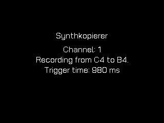
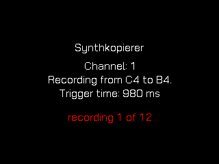
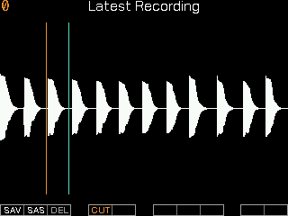

SynthCopy automates the recording of an external synthesizer by stepping through a note range, sending each MIDI note, and recording the audio response — all in one continuous take. The entire session is saved as a **single recording** that appears as the latest recording in the Sampler. You then use the Sampler's CUT tool to slice it into individual notes and assign each slice to the sample slot of your choice.

Access SynthCopy from the **Home screen → MENU → SCP**.

### 9.1 Setup

| Control | Action |
|---|---|
| ENCODER 1 (rotate) | Set the MIDI output channel (1–16) |
| LEFT / RIGHT | Change bank (shifts the note range) |
| Piano keys | Preview / send individual MIDI notes manually |

The default recording range is **C4–B4** (one octave). Changing banks shifts the range up or down.

> **Tip:** Piano key presses are sent live to the synthesizer via MIDI while setting up. If you do not hear the synthesizer respond when pressing a key, check that the MIDI cable is connected correctly and that the MIDI channel matches the synthesizer's receive channel. Also verify that the synthesizer's audio output is connected to the device's line-in.

**Setting the note duration:** The time between pressing and releasing a piano key is measured and used as the MIDI note-on / note-off duration for every note sent during the automated recording. Press and hold a piano key for the desired duration, then release it — the last measured press-to-release time is used for all subsequent automated note triggers. Do this before pressing RECORD to set the timing that matches the synthesizer's release tail.

### 9.2 Automated Recording

1. Connect the synthesizer's audio output to the device's line-in.
2. Connect the device's MIDI out to the synthesizer's MIDI in.
3. Configure the MIDI channel and note range with the controls above.
4. Press **RECORD** to start the automated sequence.
5. The device steps through each note, sending MIDI note-on messages and recording the audio response as one continuous track.
6. Press **STOP / PAUSE** to interrupt at any point.

When finished, the recording appears as the **latest recording** in the Sampler. Open the Sampler, use **MENU → CUT** to trim and slice the recording into individual notes, then save each slice to a free sample slot with **MENU → SAS**.

---

## 10. Settings

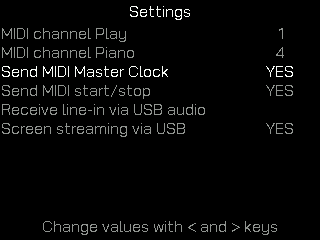

Access Settings from the **Home screen → MENU → CFG**.

Navigate with **UP / DOWN**. Change a value with **LEFT / RIGHT**. Press **SET** to exit — all changes are saved to the SD card automatically.

| Setting | Options | Default | Description |
|---|---|---|---|
| MIDI channel — Play | 1–16 | 1 | The MIDI channel Live / Play mode listens on for incoming triggers |
| MIDI channel — Piano | 1–16 | 2 | The channel the Piano sample and Synth listen on |
| Send MIDI Master Clock | On / Off | Off | Broadcast MIDI clock to connected devices |
| Send MIDI start/stop | On / Off | Off | Send MIDI start and stop signals with Sequencer / Arrange playback |
| Receive line-in via USB audio | On / Off | Off | Ignore the analog line-in and record from USB audio instead |
| Screen streaming via USB | On / Off | Off | Mirror the display to a browser in real time. **Only visible when the firmware is compiled with streaming support.** |

---

## 11. Technical Reference

### 11.1 SD Card

The SD card must be formatted as **FAT32**. Two directories are used at the root level:

| Directory | Contents |
|---|---|
| `/SAMPLES/` | Sample library — any `.raw` file placed here is available for import |
| `/SONGS/` | One subdirectory per song. To delete a song, delete its subdirectory. |

**Sample format:** 44,100 Hz, mono, 16-bit PCM raw (`.raw`). Files in other formats cannot be used.

### 11.2 Updating the Firmware

1. Download the latest pre-built `.hex` from the [`/built/`](/built/) directory, or build from source using PlatformIO.
2. Install [Teensy Loader](https://www.pjrc.com/teensy/loader.html) on your Mac or PC.
3. Open the `.hex` file in Teensy Loader.
4. Connect the device via USB. If it does not appear, open the case and press the small **program button** on the Teensy board.
5. Teensy Loader uploads the firmware automatically.

### 11.3 Screen Streaming

Screen streaming mirrors the device display to a web browser in real time over USB — useful for screencasts, tutorials, and documentation.

1. Enable **Screen streaming via USB** in Settings.
2. Open `tools/screen-stream/index.html` in a Chromium-based browser (Chrome or Edge).
3. Click **Connect** and select the device's USB serial port.
4. The display content and hardware events (key presses, encoder turns, fader position) are reflected live in the browser.

---

## Appendix A — Quick Reference Card

### Global Shortcuts

| Shortcut | Action |
|---|---|
| MENU + ENCODER 1 | Go to Sampler |
| MENU + ENCODER 2 | Go to Sequencer |
| MENU + ENCODER 3 | Go to Arrange |
| MENU + ENCODER 4 | Go to Live / Play |
| Hold MENU (5 s) | Return to Home screen |
| FUNK + SET | Undo / delete |

### Recording

| Shortcut | Action |
|---|---|
| INPUT | Cycle MIC / LINE / RESAMPLE |
| ENCODER 1 | Microphone gain |
| ENCODER 2 | Line-in level |
| RECORD | Start / stop recording |
| FUNK + RECORD | Cancel (before recording starts) |
| SWITCH | Toggle peak meter display |

### Sampler

| Shortcut | Action |
|---|---|
| LEFT / RIGHT | Change bank |
| SWITCH (empty slot) | Open library browser |
| FUNK + SET | Delete sample |
| CUT → ENCODER 1 / 2 | Trim start / end |
| FUNK + ENCODER 1 / 2 | Fine-trim start / end |

### Sequencer

| Shortcut | Action |
|---|---|
| Note Key | Place sample |
| FUNK + Note Key | Preview sample |
| FUNK + SET | Delete at cursor |
| ENCODER 1 / 2 / 3 / 4 | Velocity / Pan / Pitch / Probability |
| Push encoder | Take value from fader |
| SET + LEFT / RIGHT | Swing value |
| SET + UP / DOWN | Swing group |
| FUNK + UP / DOWN | Zoom in / out |
| FUNK + LEFT / RIGHT | Change sample bank |
| FUNK + ENCODER 3 | Fast cursor move |
| FUNK + ENCODER 4 | Song / grid length |
| MENU + LEFT / RIGHT | Previous / next sheet |
| MENU + UP / DOWN | Add / remove sheet divider |
| ENCODER 1 (empty cell) | Set BPM |
| FUNK + ENCODER 1 (playing) | Adjust BPM |

### Arrange Mode

| Shortcut | Action |
|---|---|
| White keys | Insert sheet at cursor |
| FUNK + SET | Remove sheet |
| FUNK + UP / DOWN | Add / remove repetition |
| PLAY | Start from cursor |
| FUNK + PLAY | Start from beginning |
| Black keys 1–8 | Solo channel 1–8 |

### Live / Play Mode

| Shortcut | Action |
|---|---|
| FUNK + Note Key | Edit slot |
| FUNK + SET | Remove assignment |
| LEFT / RIGHT | Change bank |
| PLAY / PAUSE | Start / stop background arrangement |
| ENCODER 1 | BPM |
| SWITCH | Assign piano sample |

